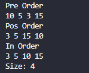
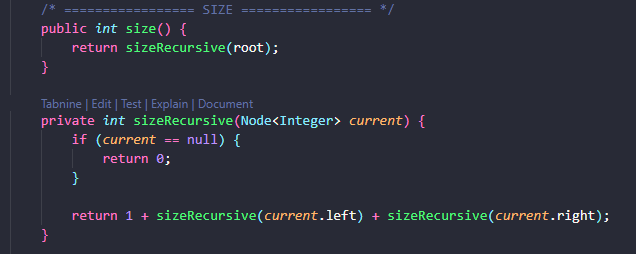
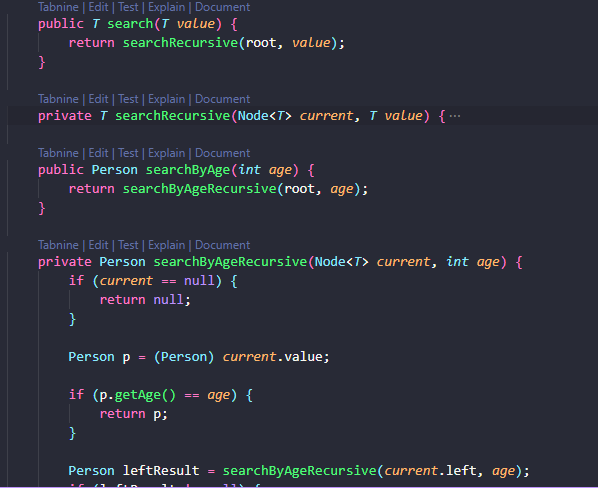
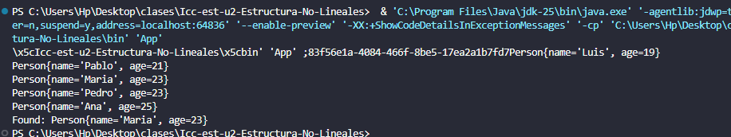
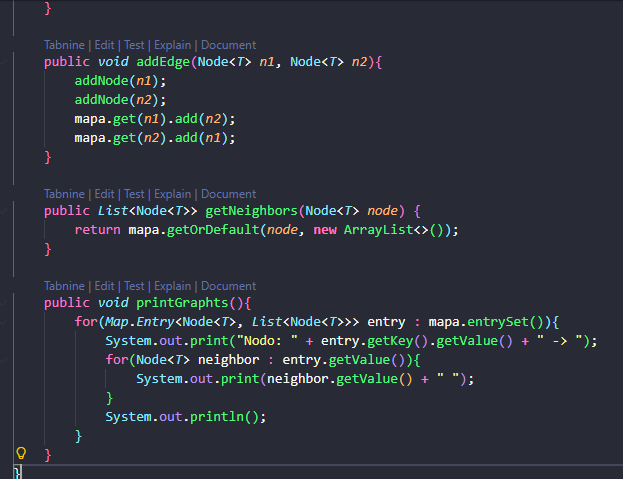
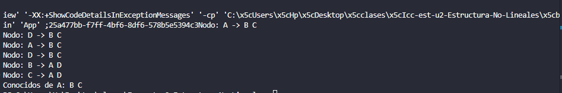

# Práctica: Estructuras No Lineales - 

## Autor
- Nombre: Joshue Avecillas
- Carrera/Curso: Estructura de Datos

##  Nombre de la práctica - Fecha
- Práctica: Estructura no lineales
- Fecha: 08/01/2026

## Descripción
Descripción de que es lo que hizo o alcanzo desarrollar en la práctica.

## Evidencias

### Captura 1 – Ejecución del programa

### Captura 2 – Tamaño del árbol

### Captura 3 – Busqueda codigo

### Captura 4 – Busqueda por edad

### Captura 5 – Mapeo

### Captura 6 – Salida del Mapeo

